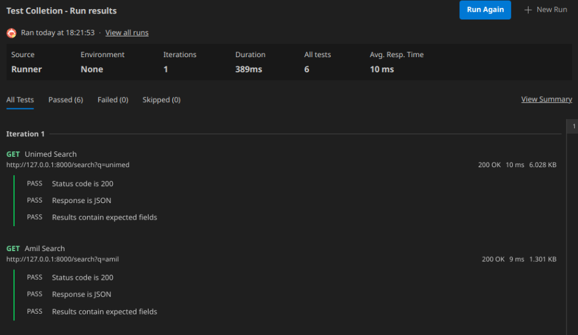
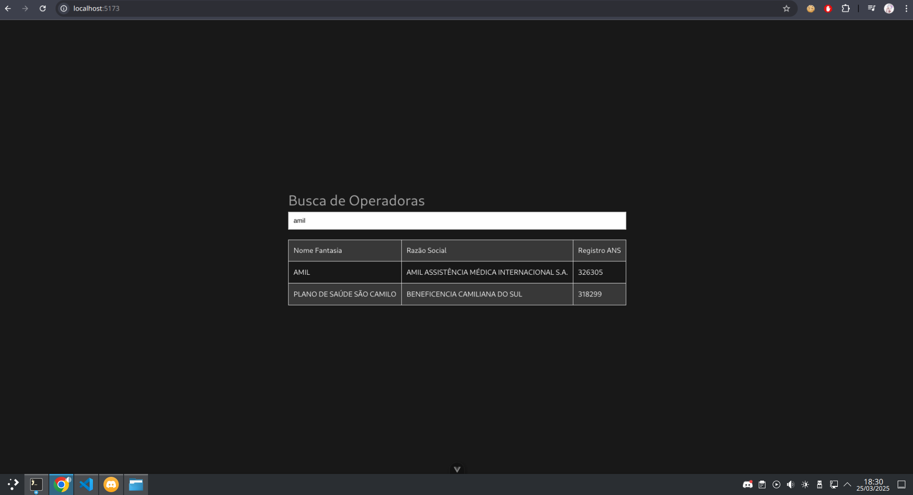
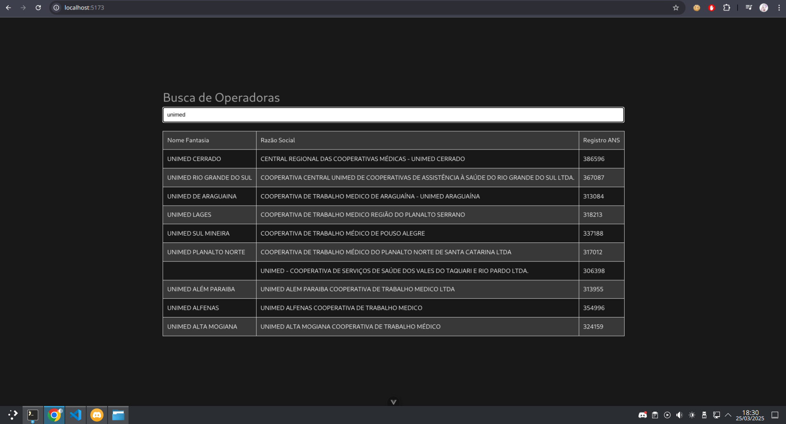

# Readme
Resumo dos arquivos e conclusão do teste

## Configurar Ambiente de testes para executar os scripts
### Arch Linux
```bash
cd
mkdir git
cd git
git clone https://github.com/MalcolnLMR/teste.git
cd teste
python -m venv webscrap
source webscrap/bin/activate
pip install -r requirements.txt
```

## Teste 1 - Web Scrap
Teste desenvolvida no `scrap.py`, arquivos baixados estão configurados no `.gitignore` para não subir arquivos desnecessários aos github.

### Como executar
```bash
python scrap.py
```

### Resultado
- `download_pdf/` contém os dois anexos em pdf
- `out/` contém o arquivo `anexos_I_e_II.zip`

## Teste 2 - Transformação de dados
Teste desenvolvido no arquivo `data_extract.py`, arquivos criados também configurados no `.gitignore`.

### Como executar
Obrigatóriamente deve ser executado após o Teste 1.
```bash
python data_extract.py
```

### Resultados
- `extracted_data/` contém o arquivo `Teste_Malcoln_Lucas.csv.zip`

## Teste 3 - Banco de dados
Teste desenvolvido nos arquivos `demo_contabil.sql`, `operadoras.sql` e `query_analitica.sql`. Feitos em arquivos diferentes a pedido do enunciado.

### Como Executar
1. Execute o seguinte script para realizar o download dos arquivos e tratar os dados para serem adicionados no banco de dados:
```bash
python data_cleanup.py
```
2. Instale um servidor SQL funcional no seu ambiente de desenvolvimento.
3. Conecte-se como usuário root.
4. Execute os seguintes comandos com o caminho absoluto da sua máquina:
```bash
source /home/malcolnlmr/git/teste-de-nivelamento/demo_contabil.sql # EXEMPLO! Troque para o caminho absoluto do seu repositório
source /home/malcolnlmr/git/teste-de-nivelamento/operadoras_ativas.sql # EXEMPLO! Troque para o caminho absoluto do seu repositório
source /home/malcolnlmr/git/teste-de-nivelamento/query_analitica.sql.sql # EXEMPLO! Troque para o caminho absoluto do seu repositório
```
mais detalhes da execução e instalação de dependencias na seção Metodologia do README.

### Resultados

```
$ MariaDB [(none)]> source /home/malcolnlmr/git/teste-de-nivelamento/query_analitica.sql
+-----------------------------------------------------------------+---------------------+----------------+
| Razao_Social                                                    | Nome_Fantasia       | Total_Despesas |
+-----------------------------------------------------------------+---------------------+----------------+
| AMIL ASSISTÊNCIA MÉDICA INTERNACIONAL S.A.                      | AMIL                |  5420109387.50 |
| MAIS SAUDE S/A                                                  |                     |  3320665176.65 |
| CAIXA DE ASSISTÊNCIA DOS FUNCIONÁRIOS DO BANCO DO BRASIL        | CASSI               |  1916519985.23 |
| HAPVIDA ASSISTENCIA MEDICA S.A.                                 | HAPVIDA             |  1853004624.60 |
| UNIMED NACIONAL - COOPERATIVA CENTRAL                           | UNIMED NACIONAL     |  1810373107.65 |
| UNIMED BELO HORIZONTE COOPERATIVA DE TRABALHO MÉDICO            | UNIMED BH           |  1495542160.01 |
| PREVENT SENIOR PRIVATE OPERADORA DE SAÚDE LTDA                  | PREVENT SENIOR      |  1486262077.73 |
| UNIMED DO EST. DO RJ FEDERAÇÃO EST. DAS COOPERATIVAS MÉDICAS    | UNIMED FERJ         |   960333156.54 |
| UNIMED PORTO ALEGRE - COOPERATIVA MÉDICA LTDA.                  | UNIMED PORTO ALEGRE |   898071708.30 |
| GEAP AUTOGESTÃO EM SAÚDE                                        | GEAP                |   798694938.92 |
+-----------------------------------------------------------------+---------------------+----------------+
10 rows in set (2.446 sec)

+------------------------------------------------------------+---------------------+----------------+
| Razao_Social                                               | Nome_Fantasia       | Total_Despesas |
+------------------------------------------------------------+---------------------+----------------+
| AMIL ASSISTÊNCIA MÉDICA INTERNACIONAL S.A.                 | AMIL                | 20820818085.36 |
| UNIMED DE SANTOS COOP DE TRAB MEDICO                       |                     | 15646249947.29 |
| HAPVIDA ASSISTENCIA MEDICA S.A.                            | HAPVIDA             |  7755562753.15 |
| CAIXA DE ASSISTÊNCIA DOS FUNCIONÁRIOS DO BANCO DO BRASIL   | CASSI               |  7459368017.21 |
| UNIMED NACIONAL - COOPERATIVA CENTRAL                      | UNIMED NACIONAL     |  7002487899.10 |
| PREVENT SENIOR PRIVATE OPERADORA DE SAÚDE LTDA             | PREVENT SENIOR      |  5920615078.62 |
| UNIMED BELO HORIZONTE COOPERATIVA DE TRABALHO MÉDICO       | UNIMED BH           |  5411476065.42 |
| GEAP AUTOGESTÃO EM SAÚDE                                   | GEAP                |  3435605702.55 |
| UNIMED PORTO ALEGRE - COOPERATIVA MÉDICA LTDA.             | UNIMED PORTO ALEGRE |  3368044333.04 |
| UNIMED CAMPINAS - COOPERATIVA DE TRABALHO MÉDICO           | UNIMED CAMPINAS     |  3059368303.48 |
+------------------------------------------------------------+---------------------+----------------+
10 rows in set (3.225 sec)
```

## Teste 4 - API
De longe o teste mais difícil de ser feito, foi desenvolvido nas pastas `frontend` e `backend`.

### Como executar
#### Backend
vá até a pasta `backend` e execute o seguite comando para iniciar o servidor:
```bash
fastapi dev main.py
```
#### frontend
vá até a pasta `frontend` e execute o segunte comando para iniciar o servidor:
```bash
npm install
npm run dev
```

### Resultados
#### Bateria de testes do POSTMAN para o backend


#### Aplicação frontend com os resultados dos mesmos testes do POSTMAN




# Metodologia

Esse é uma documentação de qual foi minha linha de raciocínio para realizar o teste de nivelamento.

## Teste de Web Scraping
### Configurando meu ambiente de desenvolvimento

#### Escolha da linguagem
Ao receber a tarefa, vi que teria que trabalhar com Python ou Java, dado o escopo do projeto, e visando a linguagem que tenho maior domínio, decidi por usar **python**.

#### Instalação de requisitos
Primeiro, instalei o `Python`, criei um ambiemente virtual e instalei as seguintes bibliotecas: `BeautifuSoup4`, `Selenium`, `Scrapy` e `Lxml`. O motivo para instalar bilbiotecas diferentes de webscreping, é para testar a velocidade de execução de cada uma e comparar a forma mais performática de se executar essa tarefa. Considerando que meu ambiente de desenvlvimento é o Arch linux usando Nvim, para realizar essas tarefas, executei os seguintes comandos:

```bash
sudo pacman -Syu # Atualizar o sistema
sudo pacman -S python # Instalar python

mkdir ~/teste-de-nivelamento # Criar pasta contendo o projeto
cd ~/teste-de-nivelamento # Ir para tal pasta
git init # Iniciar versionamento do projeto

touch README.md # Criar arquivo para explicar funcionamento do projeto
touch Metodologia.md # Criar arquivo para explicar sua metodologia de desenvolvimento

python -m venv webscrap # Criar um ambiente virtual para webscraping
source webscrap/bin/activate # iniciar o ambiente virtual

pip install --upgrade pip # Devido a natureza do Arch, provavelmente será necessário atualizar o pip

pip install BeautifulSoup4 selenium scrapy lxml # Instalar as bibliotecas
```
e também é necessário criar o arquivo .gitignore considerando o venv, por isso, usei o padrão do github, disponível em: https://github.com/github/gitignore/blob/main/Python.gitignore e adicionei os seguintes itens no arquivo:

```git
lxml/
scrapy/
selenium/
soup/
download/
anexos_I_e_II
```

#### Teste de performance
Para os testes de performance, foi feito um script usando o `timeit`, pode executar ele com:
```bash
python scrap_performance.py
```
E com o tipo de teste padrão e com 50 iterações, estes foram os resultados:
```
Tempo de execução com BeautifulSoup:
Tempo médio de 50 iterações:
0.5095246508599667

Tempo de execução com Scrapy:
Tempo médio de 50 iterações:
0.45109446000002207

Tempo de execução com Selenium:
Tempo médio de 50 iterações:
2.6060390113799077

Tempo de execução com LXML:
Tempo médio de 50 iterações:
0.5261936143798812
```
Logo, o restante do processo será usando Scrapy.

## Teste de Transformação de dados
#### Instalação de requisitos
Para começar esse teste, será necessário a instalação das seguintes bibliotecas `pandas`, `tabula` e uma versão do Java (será necessário adicionar ao $PATH ou reiniciar o sistema), e o `JPype1` para o tabula conseguir acessar o java.
```bash
sudo pacman -S jdk-openjdk openjdk-doc openjdk-src

source webscrap/bin/activate # Iniciar o ambiente virtual (se já não estiver ativo)

pip install pandas tabula-py JPype1
```

## Teste de Banco de dados
#### Instalção de requisitos
Para esse exercício, começarei instalando um serviço de banco de dados, sendo o mais compatível e recomendado com o ambiente de testes, o `MariaDB`.
```Bash
sudo pacman -S mariadb

mariadb-install-db --user=mysql --basedir=/usr --datadir=/var/lib/mysql

sudo systemctl enable --now mariadb.service
```

Não é recomendado, mas devido a natureza do teste, não será criado um usuário especifico para mexer com este banco de dados, logo, para conectar ao serviço do mariadb, basta usar o comando:

```Bash
sudo mariadb
```

#### Automação e tratar dados
Para facilitar a inserção no banco de dados, optei por primeiro usar Python para tratar os CSVs baixados e assim juntar todos os arquivos necessários em um único csv, chamado `merged_data.csv`. Para executar o download dos dados e tratar as informações como erro no nome de arquivos, data escrito errado e decimal usando "," ao invés de ".", basta executar o seguinte script:
```bash
source webscrap/bin/activate # Iniciar o ambiente virtual (se já não estiver ativo)

python data_cleanup.py
```

#### Adicionar arquivos ao banco de dados e pesquisa
Para adicionar os arquivos, basta executar os comandos:
```bash
sudo mariadb # Entrar como root no banco de dados, aconselhável estar em um usuário com baixa permissão quando for para prod

source /home/malcolnlmr/git/teste-de-nivelamento/demo_contabil.sql # EXEMPLO! Troque para o caminho absoluto do seu repositório
source /home/malcolnlmr/git/teste-de-nivelamento/operadoras_ativas.sql # EXEMPLO! Troque para o caminho absoluto do seu repositório
```
e Executando o arquivo de busca `query_analitica.sql` teremos os sequintes resultados:
```
$ MariaDB [(none)]> source /home/malcolnlmr/git/teste-de-nivelamento/query_analitica.sql
+-----------------------------------------------------------------+---------------------+----------------+
| Razao_Social                                                    | Nome_Fantasia       | Total_Despesas |
+-----------------------------------------------------------------+---------------------+----------------+
| AMIL ASSISTÊNCIA MÉDICA INTERNACIONAL S.A.                      | AMIL                |  5420109387.50 |
| MAIS SAUDE S/A                                                  |                     |  3320665176.65 |
| CAIXA DE ASSISTÊNCIA DOS FUNCIONÁRIOS DO BANCO DO BRASIL        | CASSI               |  1916519985.23 |
| HAPVIDA ASSISTENCIA MEDICA S.A.                                 | HAPVIDA             |  1853004624.60 |
| UNIMED NACIONAL - COOPERATIVA CENTRAL                           | UNIMED NACIONAL     |  1810373107.65 |
| UNIMED BELO HORIZONTE COOPERATIVA DE TRABALHO MÉDICO            | UNIMED BH           |  1495542160.01 |
| PREVENT SENIOR PRIVATE OPERADORA DE SAÚDE LTDA                  | PREVENT SENIOR      |  1486262077.73 |
| UNIMED DO EST. DO RJ FEDERAÇÃO EST. DAS COOPERATIVAS MÉDICAS    | UNIMED FERJ         |   960333156.54 |
| UNIMED PORTO ALEGRE - COOPERATIVA MÉDICA LTDA.                  | UNIMED PORTO ALEGRE |   898071708.30 |
| GEAP AUTOGESTÃO EM SAÚDE                                        | GEAP                |   798694938.92 |
+-----------------------------------------------------------------+---------------------+----------------+
10 rows in set (2.446 sec)

+------------------------------------------------------------+---------------------+----------------+
| Razao_Social                                               | Nome_Fantasia       | Total_Despesas |
+------------------------------------------------------------+---------------------+----------------+
| AMIL ASSISTÊNCIA MÉDICA INTERNACIONAL S.A.                 | AMIL                | 20820818085.36 |
| UNIMED DE SANTOS COOP DE TRAB MEDICO                       |                     | 15646249947.29 |
| HAPVIDA ASSISTENCIA MEDICA S.A.                            | HAPVIDA             |  7755562753.15 |
| CAIXA DE ASSISTÊNCIA DOS FUNCIONÁRIOS DO BANCO DO BRASIL   | CASSI               |  7459368017.21 |
| UNIMED NACIONAL - COOPERATIVA CENTRAL                      | UNIMED NACIONAL     |  7002487899.10 |
| PREVENT SENIOR PRIVATE OPERADORA DE SAÚDE LTDA             | PREVENT SENIOR      |  5920615078.62 |
| UNIMED BELO HORIZONTE COOPERATIVA DE TRABALHO MÉDICO       | UNIMED BH           |  5411476065.42 |
| GEAP AUTOGESTÃO EM SAÚDE                                   | GEAP                |  3435605702.55 |
| UNIMED PORTO ALEGRE - COOPERATIVA MÉDICA LTDA.             | UNIMED PORTO ALEGRE |  3368044333.04 |
| UNIMED CAMPINAS - COOPERATIVA DE TRABALHO MÉDICO           | UNIMED CAMPINAS     |  3059368303.48 |
+------------------------------------------------------------+---------------------+----------------+
10 rows in set (3.225 sec)
```

## Teste de API
#### Instalção de requisitos
Neste teste, será necessário a instalação do `node.js` para executar o `vue.js`:
```Bash
sudo pacman -S nodejs npm
```
E por conta da organização do projeto, o `backend` em python e o `frontend` em vue.js serão divididos em pastas com o mesmo nome. Falando primeiro do backend:
```Bash
source webscrap/bin/activate # Iniciar o ambiente virtual (se já não estiver ativo)

pip install "fastapi[standard]" # Instalar biblioteca de backend

mkdir backend # Criar a pasta
cd backend # ir para a pasta

touch main.py # Arquivo onde o servidor será executado 
```
O comando para inciar o servidor é:
```bash
fastapi dev main.py
```
Agora para o `frontend`:
```bash
cd ~/teste-de-nivelamento # Voltar para o root do projeto

mkdir frontend

npm create vue@latest
```
Para as especificações do projeto, use `frontend` como nome do projeto e pasta de instalação, vá para a pasta, e execute:
```bash
npm install
npm install axios
npm run dev
```

#### Configurando testes
Após terminar de escrever o aplicativo, é pedido que "Elabore uma coleção no Postman para demonstrar o resultado", então, foi enviado 2 requisições para o servidor python, uma pesquisando Amil, e outra Unimed. Ambas com a seguinte descrição de testes:
```javascript
pm.test("Status code is 200", function () {
    pm.response.to.have.status(200);
});

pm.test("Response is JSON", function () {
    pm.response.to.be.json;
});

pm.test("Results contain expected fields", function () {
    const jsonData = pm.response.json();
    pm.expect(jsonData.length).to.be.above(0);
    pm.expect(jsonData[0]).to.have.property("Nome_Fantasia");
    pm.expect(jsonData[0]).to.have.property("Razao_Social");
    pm.expect(jsonData[0]).to.have.property("Registro_ANS");
});
```
e estes foram os resultados:


A interface Web usando Vue.js ficou desta forma:


